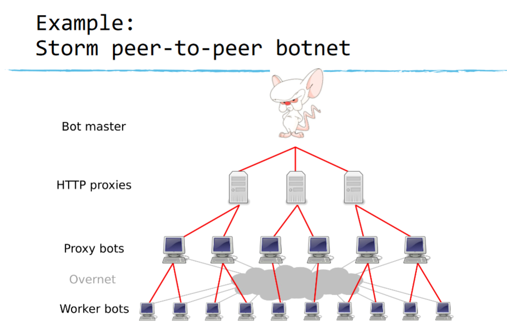
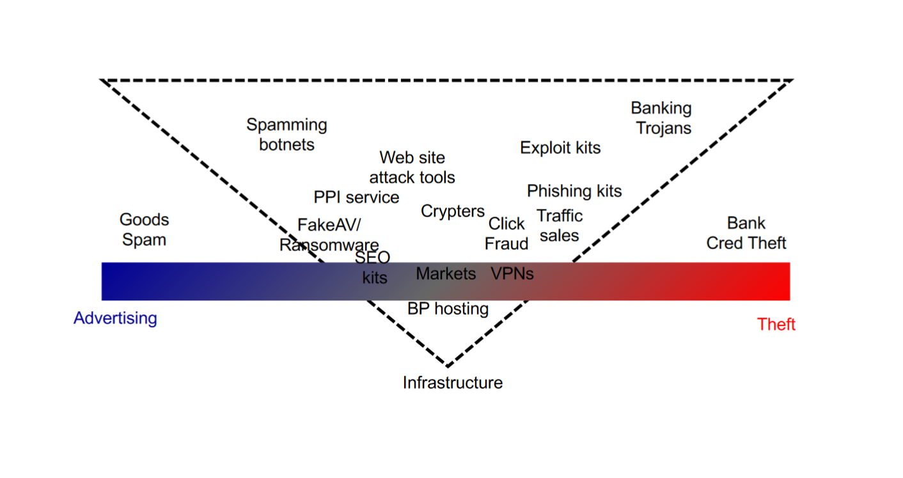
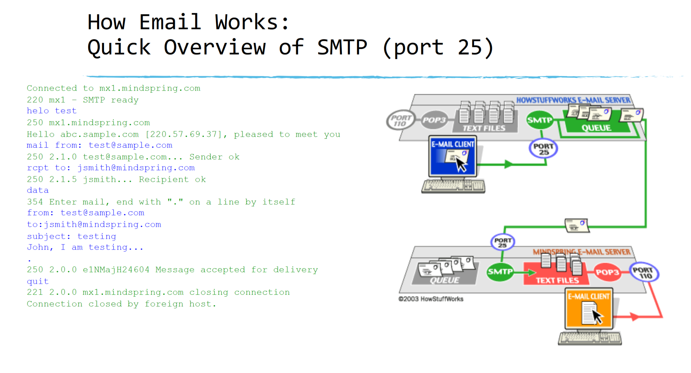
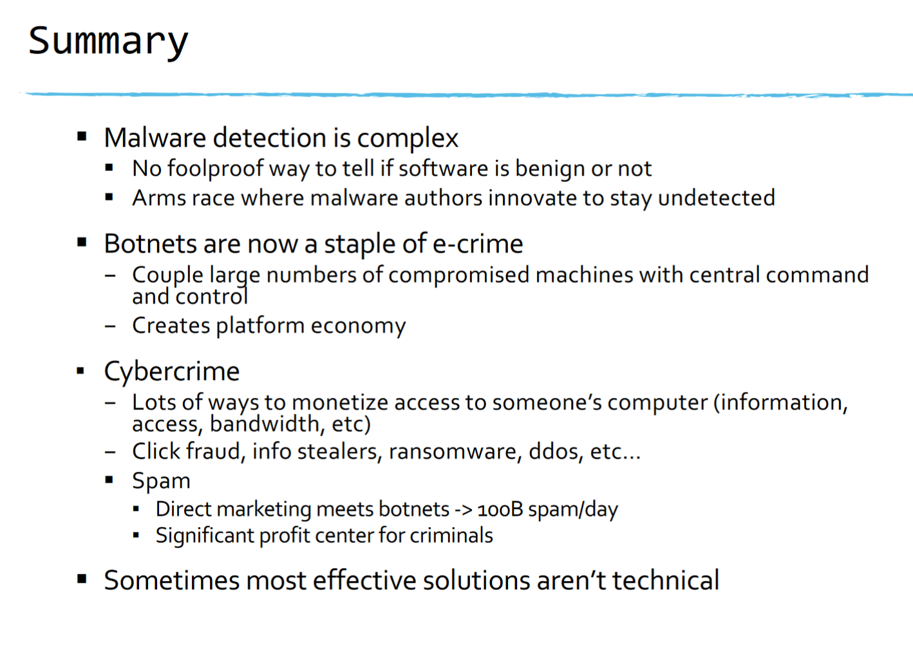

# Botnet
- A netowrk of compromised computers with a common command and control system
- The bot controller sends commands via the network to get botnet to do something "en masse"
    - Spam, phishing
    - DOS
    - Click fraud
    - Stealing local data
    - Crypto
    - Ransomware

## Botnet Architectures
- C2 Structure
    - Centralized:
    - Peer-to-peer:
- Push vs pull designs
    - Attacker sends out message to tell bots what to do (push)
    - Worker bots ask for work to do (pull)

## Updating and Recovery
- Virtually all bots today have auto-update capability
    - CHeck C2 on start to see if there is a new version.  If so, download
- Resilience/Recovery
    - What happens if someone takes over your C2? How to keep from losing whole botnet?
    - Alternate/Backup C2s
        - Round-robin: If you can't reach one, then try the another
            - Also having them in different jurisdictions
        - Domain generation algorithms
    - Digital signatures on updates (don't let someone else update your software)

## Dealing with Botnets
- Detection
    - Detecting the malware
    - Detecting network access to known C2s or using known botnet C2 protocols
    - Allow "honeypot" computers to be infected and see what they do
    - Infiltrate or takeover C2 and see which hosts connect to it
- What to do?
    - Get users to cleanup infected hosts
    - Quarantine from network (some ISPs do this)
    - Shutdown C2 (carefully) or disrupt its behavior
    - Takeover C2 and command bots to uninstall themselves (legal issues)

# What to do With Botnets?

## First major motivation: spam
- Before 2000, spammers could generally get away with sending lots of spam from a server
- Spam-based blocklists become into being
- Effectively force spammers to use many different IP address
- Botnets provide a solution

### Economic Drivers
- Starting in 2005, emergence of profit--making malware
    - Anti-spam efforts force spammers to launder email through compromised machines
    - "Virtuous" economic cycle transforms nature of threat
- Commoditization of Compromised Hosts
- Innovation in both host substrate and its uses
    - Botnets: sophisticated C2 networks
        - Platform
    - Spam, piracy, phishing, identity theft, DDoS are all applications

### Making money
- Monetize platforms of compromised host
    - Generic resources: CPU, IP address, bandwidt, storage
    - Uniwue resources: email accounts, credit card numbers, bank accounts, intellectual property
- Ultimately, must find a way to "cash out"

## Two Core Criminal Value Creation Strategies

## Click Fraud
- Assumption
    - Click on ad is a customer
- Attack
    - Deplete other ad budgets
    - Click on own ads for revenue
- Defense in practice
    - Try to identify fraudulent patterns
        - Many clicks from IP, no sales, "kind" of hosts doing clicks
    - Refund money from those

## Infostealers
- Infected machines gather information from the disk or as it is typed and send it back
    - Either via command and control channel
    - Or to "dead drop" (e.g. public website that anyone can read)
- Commercial use
    - Gathering credentials for online services, banks, credit cards, etc.
- Espionage Use (Ghostnet/Flame)
    - Gathering documents of value

- Best infostealers can defeat two-factor authentication
- In-browser malware
    - Piggybacking
        - Allow user to authenticate normally to bank
        - Piggybank theft transaction on this login
        - Rewrite bank javascript as it arrives in the browser so the bank balance is "fixed up" and theft transaction is invisible to user
    - Social engineering
        - Fake chat window asks for second factor info
- Requires custom malware for each bank (typically target one bank at a time)

## Cashout
- So... you've stolen a bunch of credit cards, or bank account credentials... Now what?
- Direct monetization
    - White plastic: create new cards and do cash withdrawals (usually outsourced for 50% commission)
    - Wire transfer (to other US bank), then "money mules" withdraw money and transfer via Western Union
- Reshipping fraud
    - Purchase goods online (dense value per pound) with stolen credit cards and send to US address
    - Reshipping mules receive item and reship to overseas location

## Extortion: Ransomware
- Malware encrypts all files and requires machine's owner to pay to unlock
    - Typically uses non-standard payment instruments: paysafecard, bitcoin
    - Will unlock data with paymen
    - Modern versions also exfiltrate data and threaten to relase it if not paid
- Historically two kinds of lures:
    - Fraudulent:
        - We are the FBI/BKA/RIAA/etc... You haave copyrighted material, CP, etc... on your machine... you will be brougt to court unless you settle
    - Straight up extortion (dominant today)
        - Pay us or you'll never see your files again
- Transition to "big game" hunting (big companies)
    - Pay us or you won't get your data and we'll release your data your data to the world
    - Big ransoms - enabled by liquidity in cryptocurrency space

## Largest Botnet Application: Spam

## Final Logistics
- What would be easy to write questions on?

## Affiliate Program Structure
- Division of Labor
    - Affiliates

