# Viruses and Worms
- Replicatinng malicious programs
    - Virsues replicate  by attaching to a host program (or document)
    - Worms replciate via the network
        - Self-spreading

## Virus design history
- Bootstrap viruses
- Memory resident viruses
    - Standard infected executable
- Encrypted viruses
- Polymorphic/metamorphic viruses

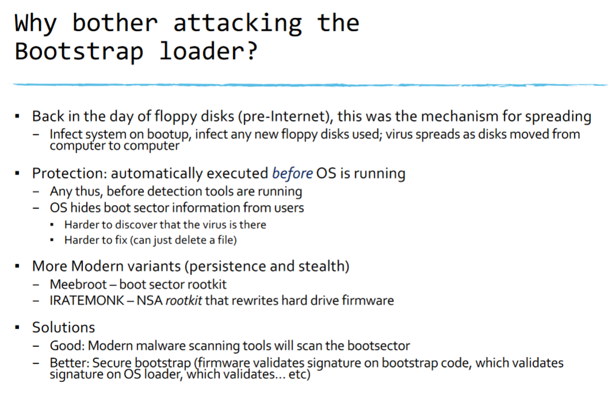

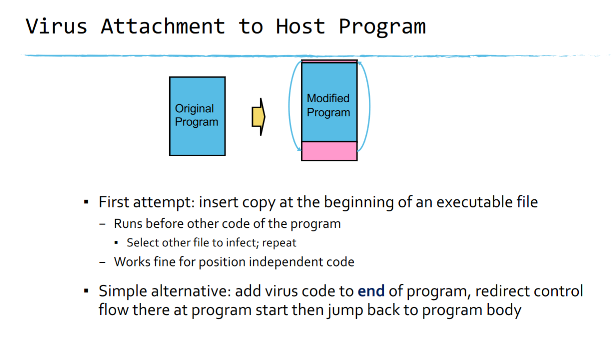

## Detecting Malware
- Scanning (signatures)
- Integrity checking (checking if file has changed)
- Behavior(heuristic) detection

# Scanning  (Signatures)
- Viruses can't be completely invisible
    - Code must be stored somewhere
    - Virus must do something when it runs
    - Identify existing viruses and extract "signature" byte sequences unique to them
    - Idea: look in files these signatures
- Issues
    - Where to scan?
    - How to scan?
    - How long to scan?
    - Are we sure there is a common signature?

### Head/Tail Scanners
- Bad guys then move the virus to the middle of the file
- Solution: scalpel scanning
    - Idea: limit scanning to likely entry-points for viruses
    - If you have more time, you can also scan for more than just strings

### Scalpel Scanning
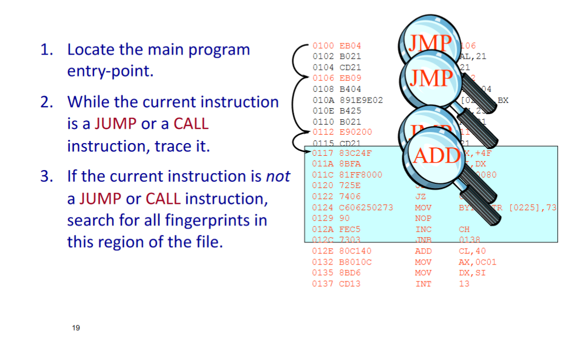

## Encrypted Viruses
- Soon after the first generation of executable viruses, virus authors began writing self-encrypting strains
- These viruses carry a small decryption loop that runs first, decrypts the virus body and then launches the virus
- Each time the virus infects a new file, it changes the encryption key so the virus body looks different
- Still easy to detect because the decryption loop stays the same: virus signature = decryption code

## The Polymorphic Virus
- Take this idea to the next step
- Polymorphic viruses are self-encrypting viruses with a changing decryption algorithm
- WHen infecting a new file, such a virus:
    - Generates brand-new decryption code from scratch
    - Encrypts a copy of itself using a complementary encryption algorithm
    - Inserts both the new decryption code and the encrypted body of the virus into target file

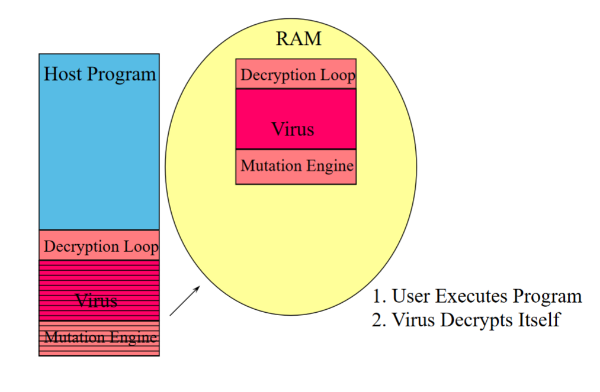
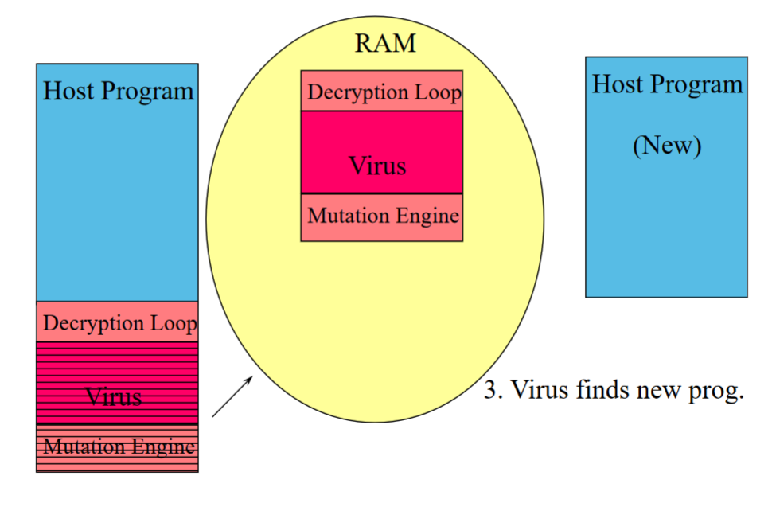
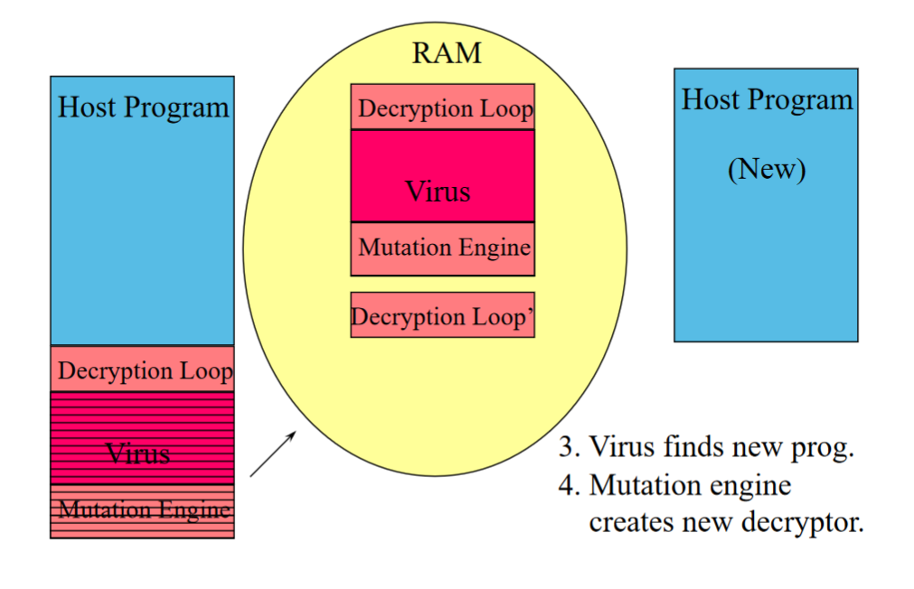
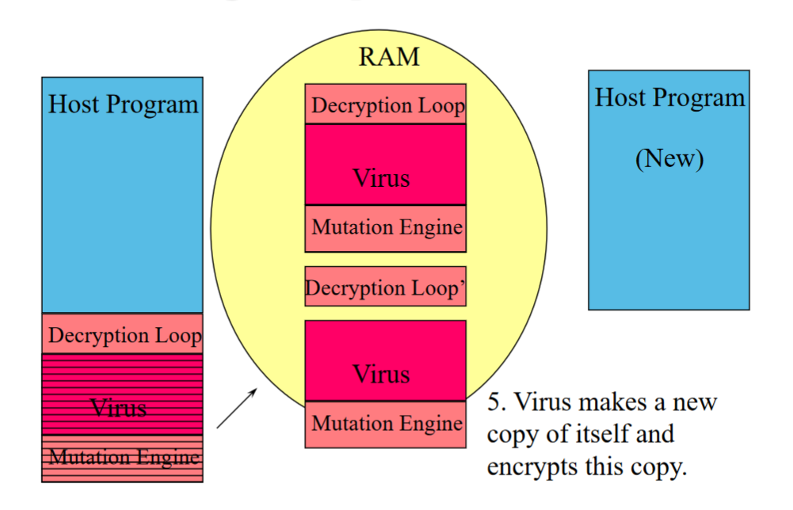
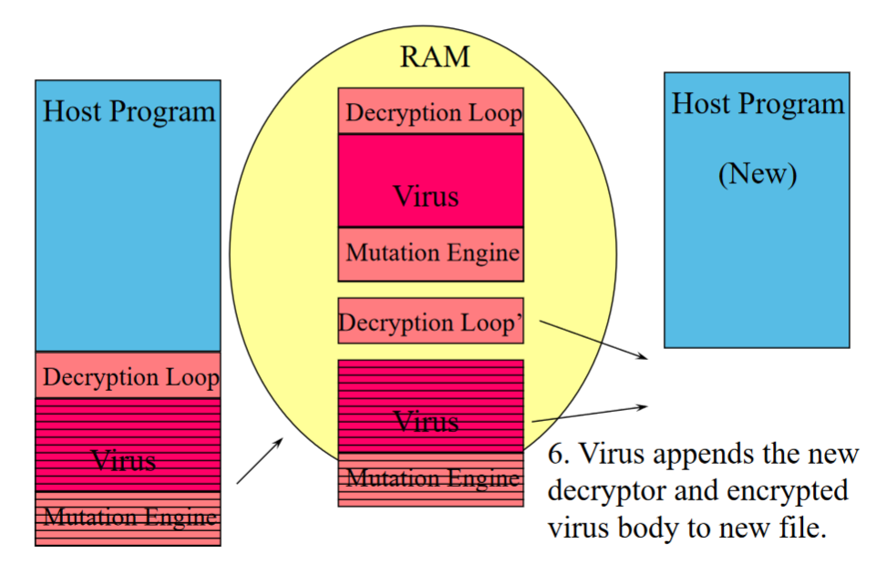
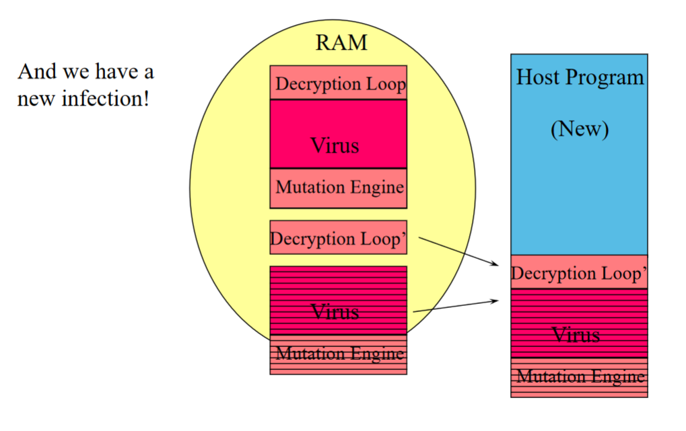

## Extremely DIfficult to Detect...
- May be no shared unencrypted code between two malware samples of the same virus
- Generic decryption
    - Key idea: let virus do the hard decryption work for you
        - Emulate code execution until the virus decrypts iteself
            - Typically use some sort of virtual machine environment
        - Search for signatures in memory
    - Assumptions
        - Virus gains control of the host immediately
        - Virus decrypts control of the host immediately
        - Virus has some static body that can be detected with traditional signatures

## Generic Decryption
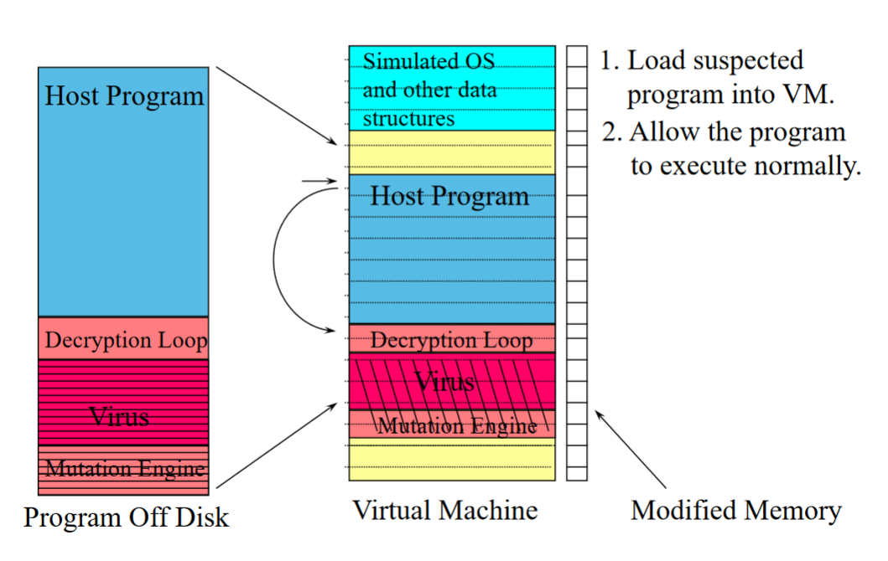
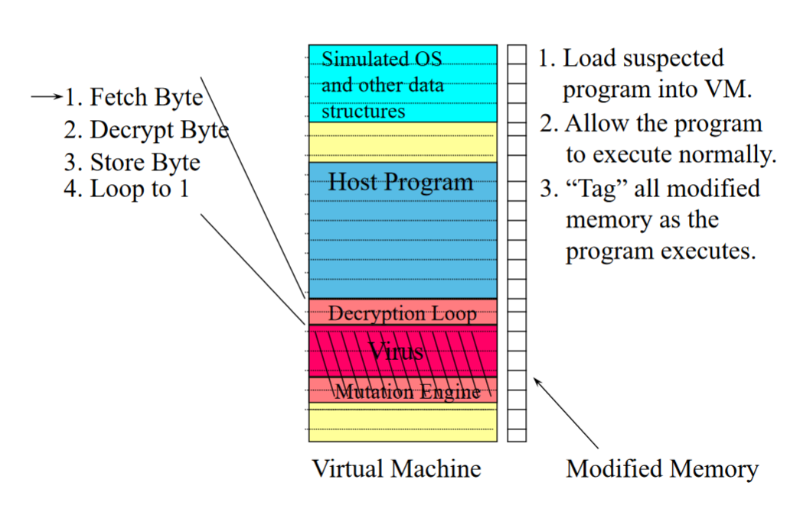
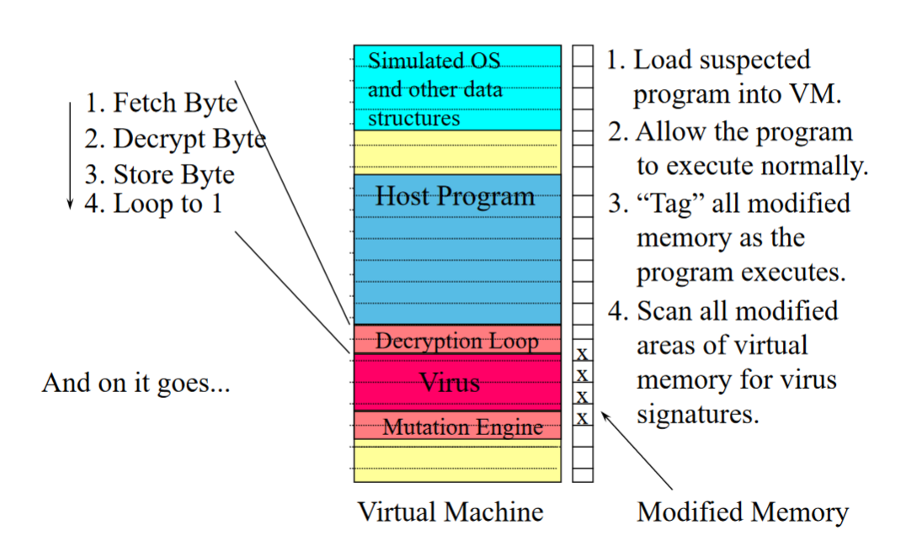
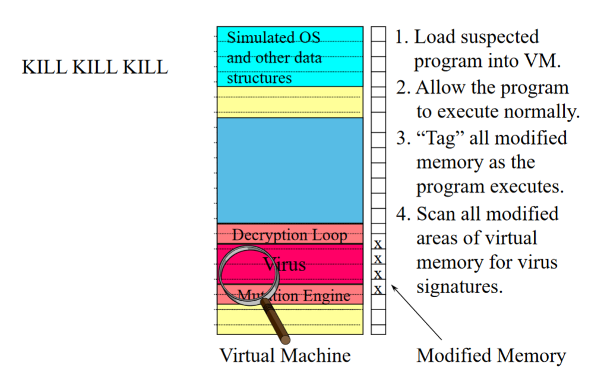

### But many problems still left...
- How long to emulate the program?
    - Further challenge: virus authors know how long you emulate... why?
- What if malware can tell its running inside a VM?
    - It can then not decrypt itself if it detects a VM
- What about malware that only activates with some specific input? Specific time?
- What if it doesn't have a signature?

## The Metamorphic Virus
- These viruses rewrite their logic in each new infection, they have no byte-level fingerprint anywhere!
- Metamorphic viruses use the current infection's code as a template and then expand and contract sets of instructions within the body to create a child infection

## Bottom Line: It's Hard
- Detection is complex and malware authors constantly work to make it harder to do signature-based detection
- Key assumptions of signature-based anti-malware software:

# Integrity Checking
- Change detection (e.g. Tripwire)
- Allowlisting
    - Import list of "known good" software
    - Validate that all programs on disk hash to something on the "known good" list
- General issues
    - Hash list must be well-protected
    - Hash list must be comprehensive and kept up to date (allowlisting)
    - Doesn't deal well with editable documents (word, excel)
    - Nore: most modern antivirus systems will send the vendor hashes and filenames of every program you run on your machine

## Behavioral Detection
- Identify suspicious behaviors in software
    - Decrypting code in memory
    - Unusual instruction sequences
    - Unusual use of file system or network interfaces (e.g. sending copy of code)
- Software reputation
    - Where did program get downloaded from? Have other people run it too? Do they get infected a lot?
    - Do filename, libraries, compile, symbols, etc... correlate with past malware
- Can run in real-time, amenable to machine-learning approaches
- Issues
    - Suspicious doesn't mean malicious; false positives
    - Forced to tune for low false positives

# Disinfection
- Ok, you found a virus in a file... now what?
- Standard disinfection
    - Virus saves the beginning of the file it overwrites (for control transfer) so it can correctly execute it later
    - To clean: find virus, find original host file beginning, find size of virus
        - Now move original code to beginning, and truncate file to eliminate virus code
    - Specialized to each virus - only worth effort for really popular ones
- Generic disinfection
    - Run program and emulate until it restores the file to its normal state (so it can execute normally); let the virus itself do the hard work
    - Rewrite cleaned program back to disk
    - Works with majority of viruses
    - Problems: viruses that overwrite code, viruses with unknown entry points, viruses not well modeled by heuristics - when is image clean?
- In practice today? Just wipe machine and reinstall everything

### Today, not so many "viruses"
- Why? File sharing isn't the best vector for replication
- What is? The Internet

# Worms

## First Big Worm (Morris Worm)
- November 1988
- Shutdown bug chunks of the internet and email

## The Modern Worm Era
- Enail based worms in late 90's
- CodeRed worm released in Summer 2001
- Slammer (2003)
- Energizes renaissance in worm construction (1000's)

## How to think about network malware outbreaks
- Well described as infectious epidemics
    - Simplest model: Homogeneous random contacts
- Classic SI model
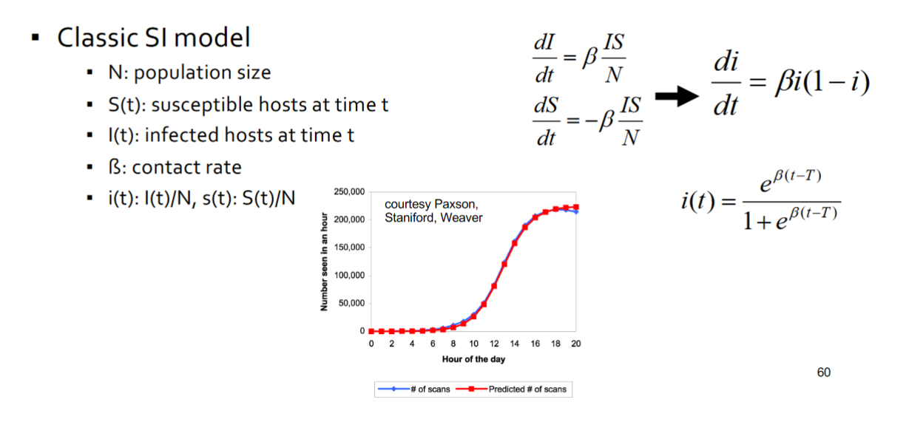

- Two things matter when considering the scope of an outbreak
    - How likely is it that a given infection attempt is successful?
        - Vulnerability distribution
        - Target selection
    - How frequently are infections attempted?

## What Can Be Done?
- Reduce the number of susceptible hosts
    - Prevention, reduce S(t) while l(t) is still small
- Reduce the number of infected hosts

