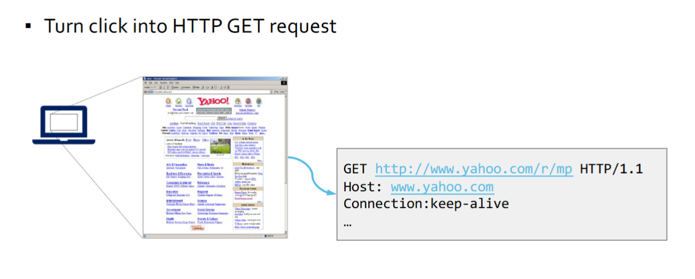
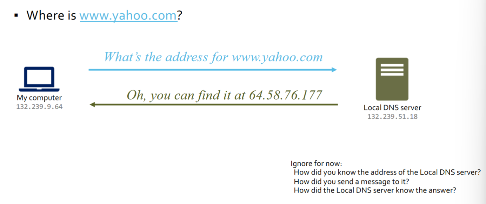
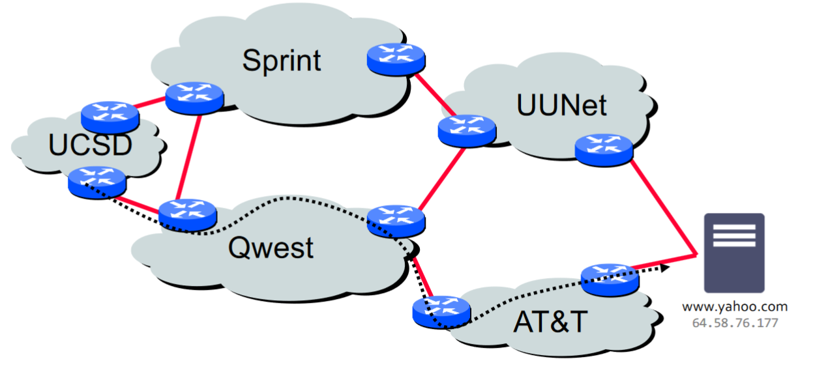
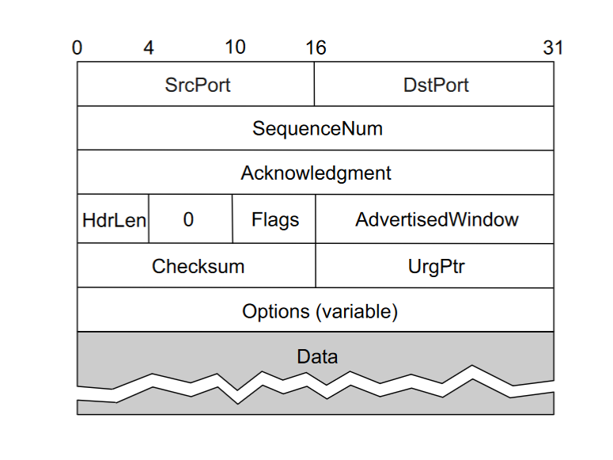
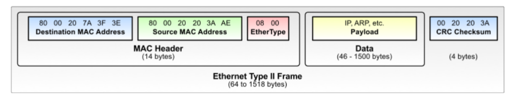
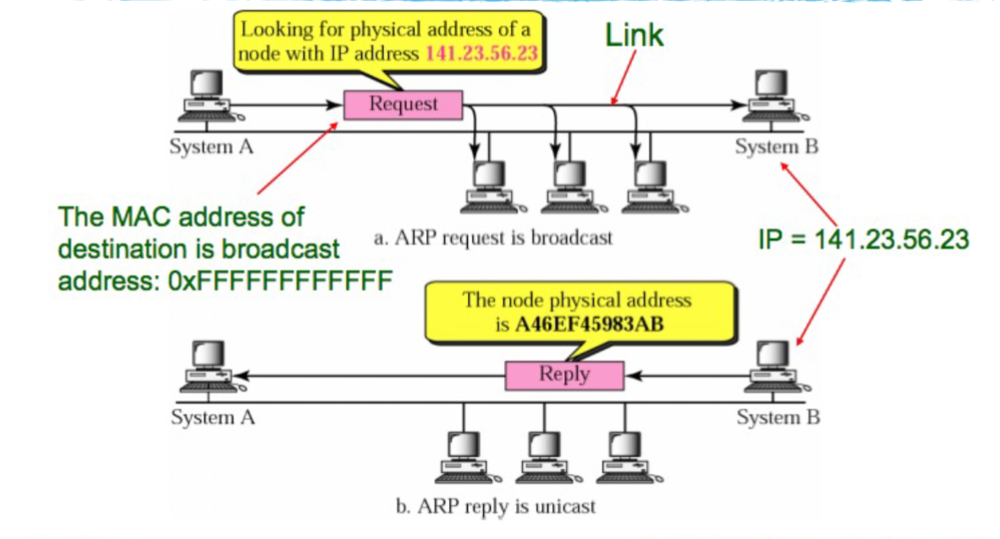
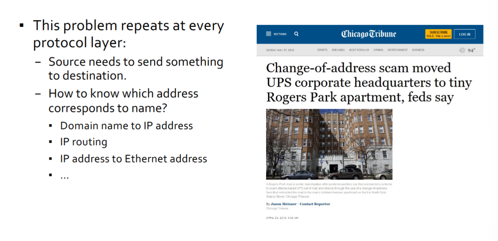

# CSE 123 Crash Course

## First: Packets
- All communcations on the internet is constructed of discrete, seld-addressed, chunks of data: packets
    - Packet, frame, segment, datagram, cell, etc.
- This is different from older circuit switched networks (i.e. traditional phone system)

## Internet Protocol Suite
- Application Layer
    - Examples: SMTP, FTP, SSH, HTTP, HTTPS, etc.
- Transport Layer
    - User datagram protocol (UDP): single packet transmission with no reliability or ordering mechanisms
    - Tranmission control protocol (TCP): connection establishment, reliable transmission, and flow-control
- Internet Layer (IP)
    - Fragmentation, reassembly, and end-to-end (across network boundaries) routing of data packets
    - Provides a uniform interface that hides the underlying network topology
- Link Layer
    - Transmission of data frames within a local network (without intervening routers)
    - Example: ethernet
- Physical Layer
    - Transmission of raw bits (rather than logical data packets) over a physical data link connecting network nodes

# Example

## Application Layer (HTTP)

### Name Resolution

## Transport Layer (TCP)
- Break messages into pieces (TCP segments)
- Should be delivered reliably and in-order

## Network Layer: IP Addressing
- Address each packet so it can traverse network and arrive at host
- Addresses are generally global unique

### IP Routing
- Each router forwards packet towards destination

## Datalink Layer (Ethernet)
- Media Access Control (MAC)
    - Who gets to send when?

- Send individual frames on a link

## Physical Layer

### IPv4 Packet Header

- TTL is the hop counter

## IP Protocol Functions (Summary)
- Routing
    - Your IP host knows location of the local router (gateway)
    - IP gateway must know the routes to other networks
        - Packets usually take multiple hops to get to their destination
    - Address are globally meaningful
        - 32 bits (IPv4) address separated into network part and host part (127 bits w/IPv6)
- Error Reporting
    - Send internet control message protocol (ICMP) packet back to source if there was a problem
- Fragmentation and Reassembly
    - If max-packet-size on next hop link < user-data-size in IP packet
- TTL Field: decremented after every hop
    - Packet dropped if TTL=0. Prevents infinite loops.

## Fragmentation
- Sender writes unique value in identification field
- If router fragments packet, it copies _this id_ into each fragment
- _Offset_ field indicates position of fragment in bytes (offset 0 is first)
    - MoreFragments flag indicates that this isn't the last fragment
    - DontFrgment flag tells gateway not to fragment
- All routers must support 576 byte IPv4 packets (MTU)

### IP Fragmentation and Reassembly

## TTL (Time-To-Live)
- How many more routers can this packet pass through?  
    - Designed to limit packet from looping forever
- Each router decrements TTL field
- If TTL is 0, then router discards packet

## TCP Primer
- TCP provides reliable, ordered delivery of bytes
- Establishes a stateful bi-directional session between two IP:port endpoints
- Each side maintains:
    - Sequence number: sequence base (i.e. start from here) + count of bytes sent
    - Acknowledgement number: acknowledgement base + count of bytes received
- Special Packet Flags
    - SYN: I want to start a connection
    - FIN: I want to shut doen a connection
    - RST: We are killing this connection now

## TCP Header Format
- Ports plus IP addresses identify a connection

### Most Important Numbers in networks
- Src/Dst IP, Src/Dst Port, and Transmission Protocol

### Connection Setup: Agree on Initial Sequence #'s
Three-way Handshake

## TCP/IP Security (1970s)
- Original TCP/IP Design: Trusted Network and Hosts
    - Administered by mutually trusted parties
- End-to-end priniciple
- Robustness Principle
    - “In general, an implementation must be conservative in its sending behavior, and
liberal in its receiving behavior. That is, it must be careful to send well-formed
datagrams, but must accept any datagram that it can interpret (e.g., not object to
technical errors where the meaning is still clear).”

- Built-in trust assumptions
    - Network protocols used only as intended
    - Hosts controlled by trusted administrators

## TCP/IP Security (1980s)
- 1980s Threat Model
    - Can't trust the hosts
        - Compromised hosts
        - Untrusted insiders
        - Anyone can connect to public internet
    - But network is still trusted

## TCP/IP Security (Today)
- Can't trust the network either
    - Network equipment can be compromised
    - Untrusted network operators
    - Anyone can access the physical channel of wireless networks

# Attacker Models
- Person in the middle: can see, block, and modify traffic
- Eavesdrop on traffic
- Off-path: attacker can inject traffic into network

## No Confidentiality
- Who can see the packets you send?
    - Everyone
- Need to take care of confidentiality at appplication layer

## No Authentication
- TCP/IP offerns no authentication of packets
- Attacker with direct access to network can spoof source address
- Connectionless Protocols (UDP) especially vulnerable
- Some consequences:
    - Can blast packets at a target and, by using spooofed source addresses, make it look like someone else is attacking them
    - Can try to interfere with existing communications between hosts
    - Can't count on source address for authentication

## Link Layer Interception
- Physical channel is often shared by multiple hosts on the local network.
    - Examples: open WiFi, non-switched Ethernet
- Link layer controls access to the physical medium.
    - Also known as the Media Access Control (MAC) layer.
    - Apologies: acronym collision
- How to make sure each host only gets frames addressed to it?
-Each host is responsible for picking up frames addressed to it and ignoring the others.
    - Honor system!
- Filtering typically happens on the network card (or equivalent).
    - Only frames addressed to this host are parsed and passed on to the layer above.
- Many support “promiscuous” mode – all frames are picked up

### But you can intercept in other ways too...
- Host configuration
- Address binding (IP to MAC)
- Routing

## Network Routing
- Say I want to send packet to 8.8.8.8
- Step 1: Is destination on local network?
    - Check subnet masks of local networks
- Step 2: Create IP packet
- Step 3: Create and send link layer (e.g. Ethernet) frame
    - 48 bit source address, 48 bit destination address
- Step 4: Gateway picks next router in path and forwards the IP packet
    - Repeat until destination is reached
    - How to know which router to forward to next?

### How do we know all of this stuff?
- The address of the router, my own IP address, the netmask, the address of the DNS server, etc.
- Dynamic Host Configuration Protocol (DHCP)
    - Automatically configures each new host attached to network
    - Basic idea
        - Host broadcasts “DHCP discover” on local network (special broadcast address)
        - DHCP server responds with information for your host (IP addr, gateway, etc)
    - What if someone listens for DHCP requests and sends answer?
        - Can tell someone to use the router of their choosing (and DNS server)
        - One partial defense, DHCP snooping: network switch configured to block DHCP messages from non-trusted hosts that aren’t known to be DHCP servers

---
- Ethernet Frame:

- Host needs to fill in ethernet destination address
- How to find ethernet address form an IP address?

## Address Resolution Protocol (ARP)
Used to query hosts on local network to get link-layer address for an IP address
- Protocol sketch
    - Alice (looking for Bob’s IP) broadcasts an ARP request:
        - “What is the MAC address of 10.0.0.3?”
    - Bob sees broadcast (asking about his IP address) and replies:
        - “The MAC address of 10.0.0.3 is 01:02:03:04:05:06.”
    - Alice sends IP packet for 10.0.0.3 in an Ethernet frame to 01:02:03:04:05:06

- ARP messages are link-layer frames (i.e. ethernet/wifi)
- ARP Requests are broadcast (on the local subnet)
- Anyone can send an ARP reply

## ARP Spoofing
- Since
    - ARP requests are broadcast (on the local subnet)
    - Anyone can send an ARP reply
- Attacker on the network can impersonate any other host
    - Who has the MAC address for IP address 8.8.8.8?
    - “Uh… I do… send your traffic to me…”
- Mitigation
    - Static ARP tables
        - Impractical for all but small fixed networks
    - “Port binding” on switch
        - Restrict MAC and IP addresses allowed to a single port on a switch at a time; first mover wins
        - Might not work well for WiFi… why not?
    - Depend on higher level host authentication to save you
        - E.g. SSH or TLS

## Problems with Adressing

