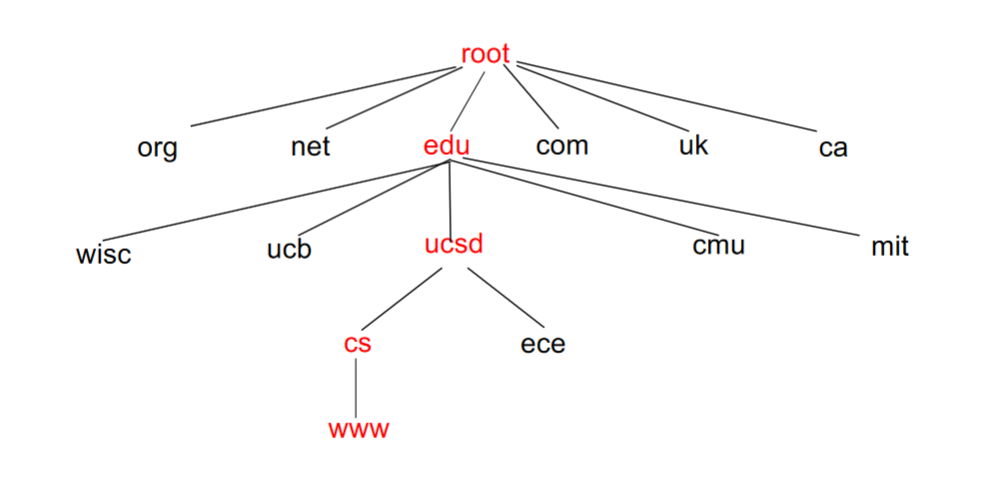
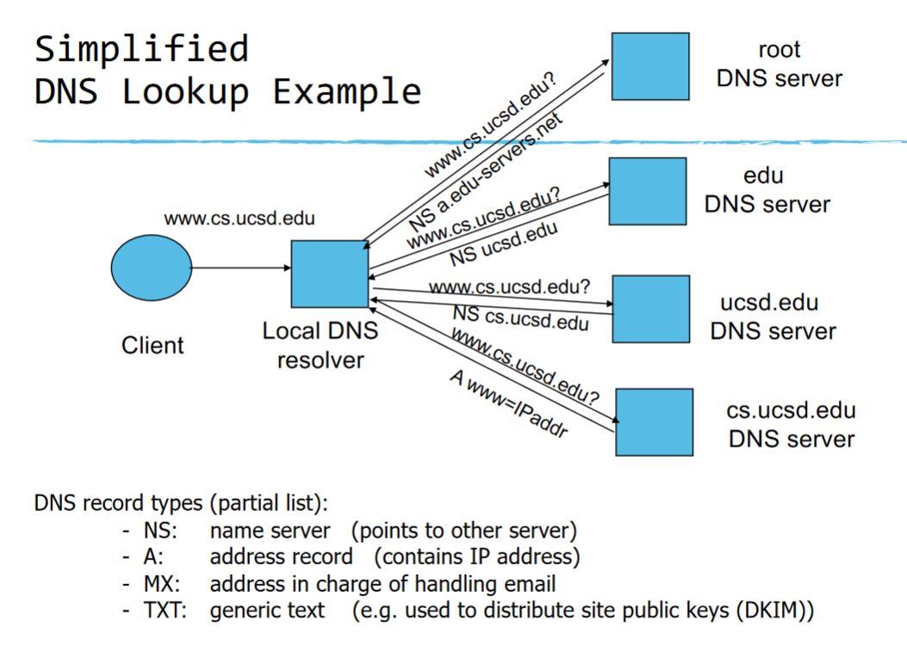
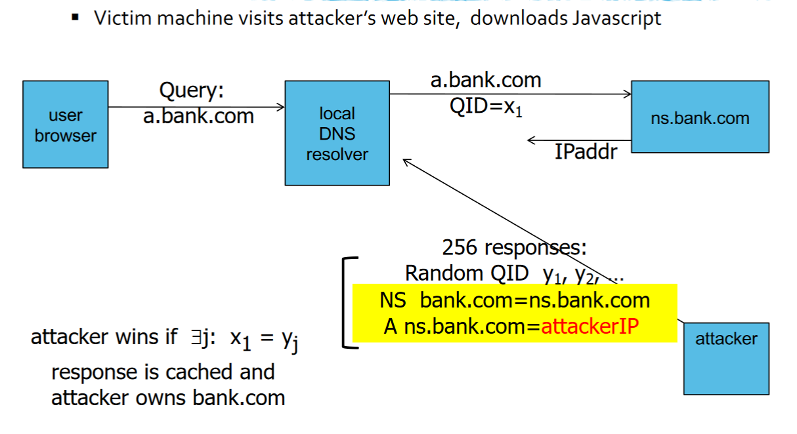
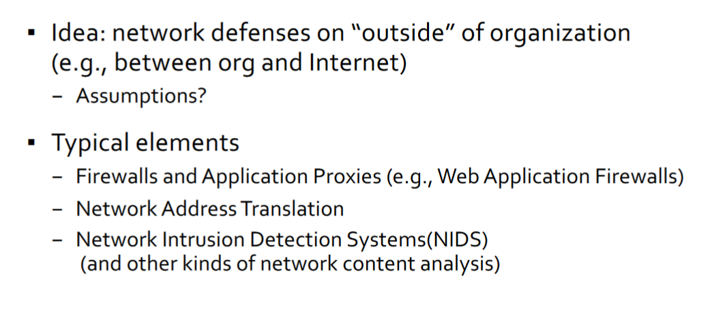
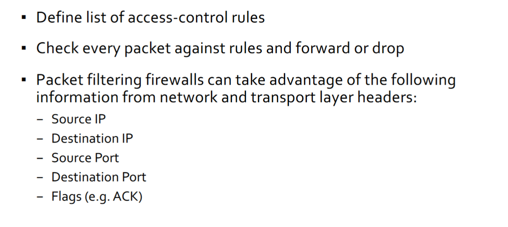

# Domain Name System
- How to map DNS names to IP addresses?
    - In the old days, we had a big file
    - Today we use a distributed name servers called the Domain Name System (DNS)

### Hierarchical Name Space

## DNS Root Name Servers
- Hierarchical Service
    - 13 root name servers for top-level domains (13 AP addresses)
    - Hardcoded into all systems
    - Choose one at random
        - Note many hundreds of replicas, not just 13 individual servers
    - Authoritative name servers for subdomains
    - Local name resolvers (also called recursive resolvers) contact authoratative servers when they do not know a name

## Simplified DNS Lookup Example

## Caching
- DNS responses are cached
    - Quick response for repeated translations
    - Useful for finding namerservers as well as IP addresses
- DNS negative queries are also cached
    - Save time for nonexistent sites, e.g. misspelling
- Cached data periodically times out
    - TTL
    - TTL passed with every record, delete cached entry after TTL expires

## DNS Cache Poisoning
- Basic idea:
    - If I can convince a DNS resolver to cache a bad mapping
(e.g., www.cs.ucsd.edu points to 127.0.0.1) then everyone
who uses it for www.cs.ucsd.edu will get that incorrect resolution
    - Can then be used for fraud, man-in-the-middle attacks, etc
- Used in lots of attacks
    - January 2005, the domain name for a large New York ISP, Panix, was hijacked to a site
in Australia.
    - In November 2004, Google and Amazon users were sent to Med Network Inc., an
online pharmacy
    - In March 2003, a group dubbed the "Freedom Cyber Force Militia" hijacked visitors to
the Al-Jazeera Web site and presented them with the message "God Bless Our
Troops“
    - 2000 campaign: Hilary2000.org -> hilaryno.com
    - Gazillions of others… super common

### But how to do it?
- Person-in-the-middle network attacker: easy
    - Observe DNS requests from server
    - Send false response to server and block true response
- Passive monitor attacker: also easy
    - Observe DNS requests from server
    - Send False response to server before true response
- What about off-path attacker?
    - If you know when user is likely to make a request, you can flood responses to their server blindly
    - But there's a problem, matching request and response

## DNS Packet
- Query ID:
    - 16-bit random value
    - Links response to query

## Resolver to NS Request
- Context
    - SBC Global customer looks up unixwiz.net
    - Goes to their DNS server dnsr1.sbcglobal.net
    - This is the request sent from that server to c.gtId-servers.net which can give answers for domains ending in .net

## Response to Resolver
- Response contains IP address of next NS server (called "glue")
- Response ignored if unrecognized QueryID

### Early Attack Strategy

## Solution: Bailiwick Checking

## But we forgot something...
- A decade goes by and Dan Kaminsky realizes that the bailiwick checking rule only _looks like_ it protects us
- Unnoticed hole that allows arbitrary DNS poisoning at a distance
- To fix bug, unprecedented coordinated global operation to do secret mass migration of all major DNS infrastructure (2008)

## DNS Cache Poisoning (a la Kaminsky '08)

## Defenses
- Increase Query ID Size
    - Randomize src port and make sure it matches, additional 11 bits
        - Now attack takes hours
- Try to detect poisoning
    - and refuse to cache targets
    - Ignore responses not directly necessary to query
    - Detect failed query matching
- Authenticated requests/responses
    - Provided by DNSsec (digital signatures on DNS records)... but few domains use DNSsec

## DNS Summary
- Current DNS system does not provide strong evidence binding
request to response
- Response can provide more data than was asked for
- Together allows attacker to “poison” DNS and divert traffic to their sites
- This is also why its so important for HTTPS to check certificate signatures (i.e., because just because you ask for www.amazon.com doesn’t mean you’ll get it)

# Network Perimeter Defense

## Firewalls
- Problem: You'd like to protect or isolate one part of the network from other parts
    - Typically: protecting your network from the global internet
    - Sometimes:
        - Network fragmentation
        - External hygiene
- Need to filter or otherwise limit network traffic

### Kinds of Firewalls
- Where they run
    - Personal firewalls
        - Run at the end hosts
        - Benefit: has more application/user specific information
    - Network firewalls
        - Intercept and evaluate communications from many hosts
        - Deployed “in-line” in network infrastructure (i.e., mediates all communications)
- What they filter on
    - Packet filters
        - Operate by filtering on packet headers content
    - Proxy-based
        - Operates at the level of the application (e.g., HTTP Web proxy)

### Network Firewall: Common Example

## Access Control Policies
- A firewall tries to enforce and access control policy
- Distinguish between inbound and outbound connections
- Conceptually simple access control policy
    - Permit users inside to connect to any service
    - External users are restricted

## Defaults
- How to represent policy?
- Default allow/deny
- Default deny is generally safer

## Packet Filtering Firewalls

## Proxy-Based Firewalls

## Firewalls Pro/Con
- Benefits
    - Reduced "attack surface" against external attackers
    - Filter out lots of "noise" in network traffic
    - Reduced liability (common practice)
- Costs
    - Actual cost: both hardware and administration
    - Bottleneck and single point of failure on network
    - False sense of security
        - Limited language (addresses, ports); doesn’t help with worms/viruses, ssh exploits, cross-site scripting, Inside vs outside model is fragile (once an internal host is compromised firewall does no good); What about wireless laptops?
        - Modern companies increasingly offer no additional trust to machines inside the firewall (so-called “zero trust” architectures)

## Network Content Analysis
- Lots of devices want to look at network traffic content for security
    - Network Intrusion detection/prevention Systems
(NIDS/NIPS)
        - Try to find signatures of attacks or malware
    - Spam filters
        - Try to detect unwanted e-mail
    - Data leakage
        - Try to prevent sensitive information from leaving company
    - Traffic differentiation
        - Filter or slow down BitTorrent traffic, Netflix traffic, etc
- Doing this as in the network is attractive because its cheaper and
easier to manage than putting endpoint monitoring on each host

### Challenges
- Expensive to look into each packet
- Network vantage point is imperfect

## Network Evasion
