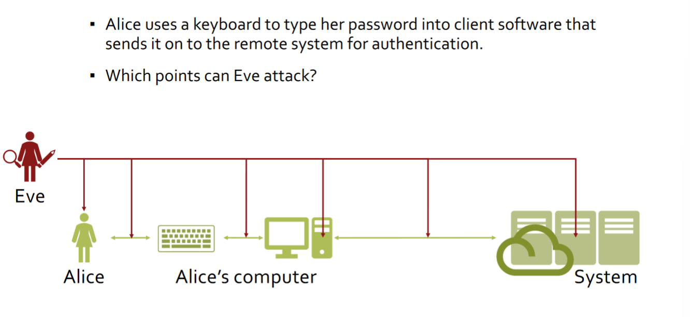
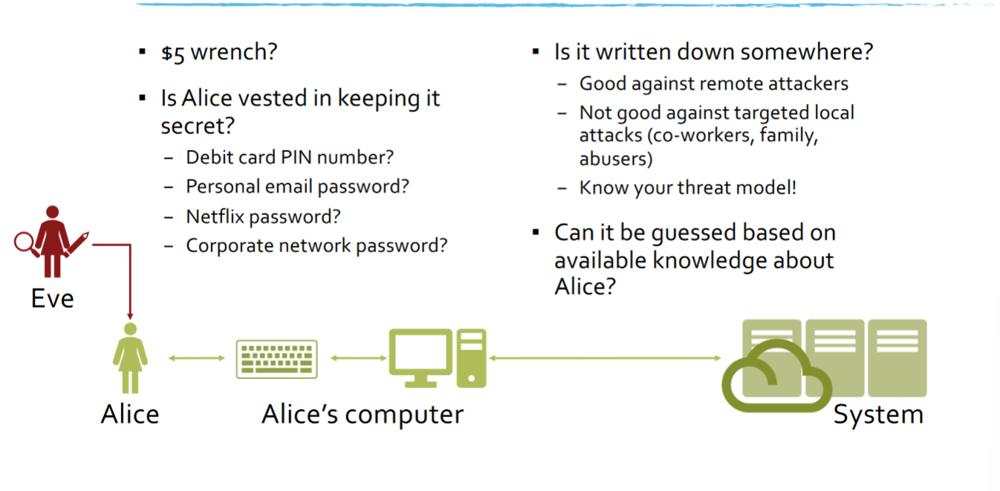
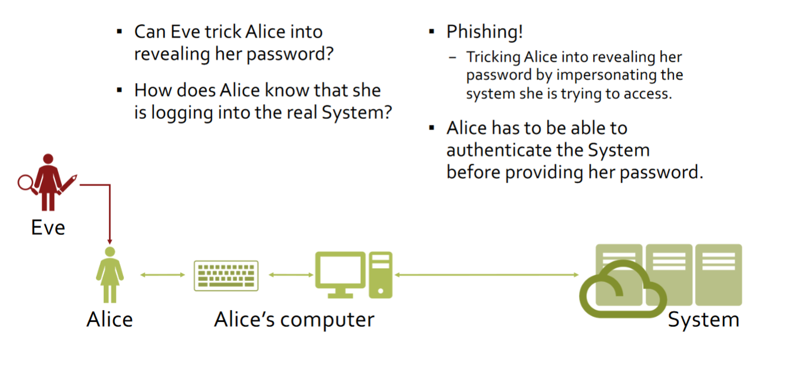
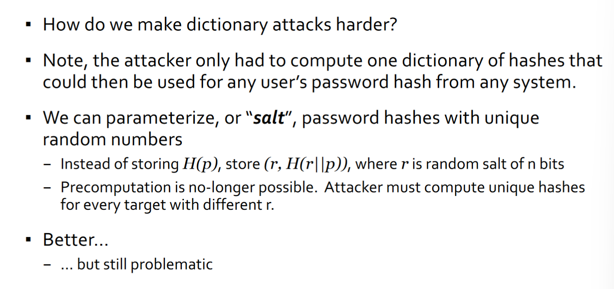
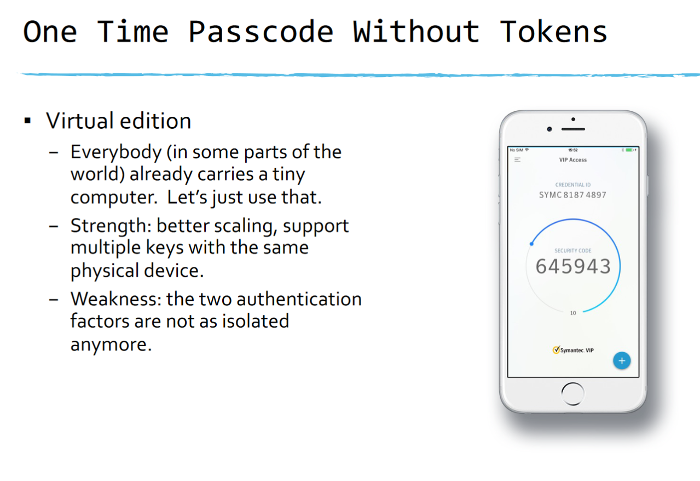
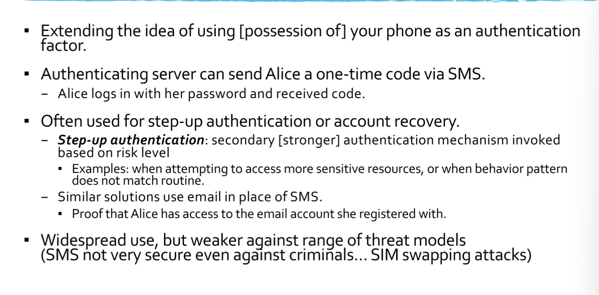
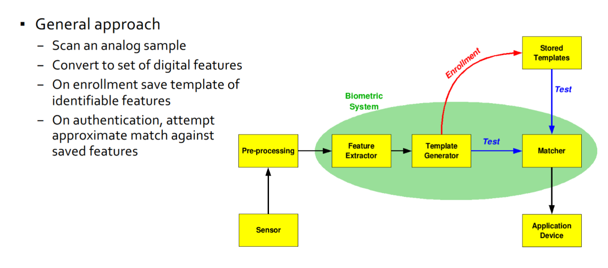
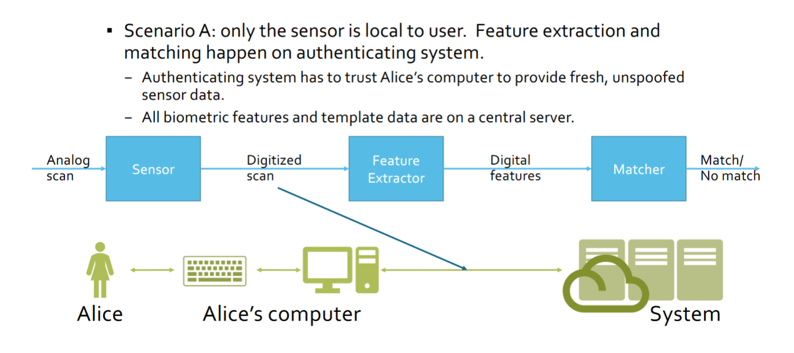

- Change of Focus
    -How do we determine if a process is running on behalf of a particular trusted party

## Authentication
- Using cryptography Alice and Bob can authenticate each other by proving thye know respective secret keys

- Provide identity and proof of identity
    - Ex: Name, Username, Student ID, etc.

### 3 Types of Authentication Factors
- Password: Something you know
- Token: Something you have
- Biometrics: Something you are
- Each factor can be used independently, or combined for multi-factor authentication

## Something You Know
- A secret that only Alice should know
    - A secret passcode (PIN, password)
- Technically, only proves knowledge of secret, not that it's really Alice
    - Secrets leak, can be shared, guessed, brute forced, etc.

## Passwords
- How does Alice prove she knows the password?
- Simplest: Alice provides the password to the system

### Setting

## Attacking Passwords

### Strong Passwords
- The challenge is to come up with passwords that are hard to guess, but easy to remember
- Common password rules:
    - Composition, length, lifetime
- But... Unintended Consequences
    - Required letters/symbols
        - Easy to crack with those required symbols
    - Monthly change requirement
        - Users will lazily update their password

## Attacking Passwords

## Phishing
- How can Alice authenticate the system?
- HTTPS certificates validate the URL
- What does it really tell you?
    - That you are communicating to ucsd.edu and your connection is secure (confidentiality and integrity are protected) against passive and active attackers on the link
- How do you know ucsd.edu is a legitimate UCSD website?
- What if the user knows which domain is real?
- Homoglyphs: symbols that appear idnentical or very similar
- Attack: register domain names that look just like the victim domain, but using a different character set
- Homoglyph Attack Generator

## Attacking Passwords
- Shoulder-surf
- Side Channels
- Hardware keyloggers
- Software keyloggers
- Passwords in memory
    - internal buffers
    - Clipboard
- Stored Passwords
    - Cached passwords (e.g. browers)
    - Password managers
    - Passwords.txt
- Monitoring the transmission channel
- Use system as an oracle: try to log in with different passwords
    - Defense: Minimize error information, Limit number of login attempts per user
    - Attack: try different users for common password
- Compromise password database
    - Huge yield to user-side attacks
    - _Password reuse issues..._

## Protecting Passwords
- How can the system verify that the password Alice entered is correct?
- Naive solution: store a copy of the password and compare provided copy to the stored one
- Problem:
    - If system is compromised, passwords are revealed
        - Same passwords may be used on other systems

### Other Solutions?
- What if the system stores a cryptographic hash of the password?
    - Better, but still problematic
- Given a hash of a password, Eve can use it to validate guesses
    - Also, obvious which users have identical passwords
- Dictionary Attacks
    - Dictionary: collection of possible, or likely, password strings
    - Try every string in the dictionary until the correct entry is found

### Be careful about computation assumptions
- Password cracking clusters are insanely fast
- For state actors, custom hardware feasible

### People don't pick random passwords
- We pick strings we can remember...
- Real dictionary attacks use password dictionaries
    - Combination of words, numbers, letter translations, inversion, etc. that are in common use
    - Can typically guess 20%-50% of passwords in the first billion guesses

### How do we make dictionary attacks EVEN HARDER
- So we can use a deliberately slow and resource-consuming hashing function
    - PBKDF2, bcrypt, scrypt

### Building blocks of password protection:
- Hash
- Salt
- Slow down

### Use one of:
- PBKDF2
- bcrypt
- scrypt

# Something You Have
- Something only Alice should have
    - Key, smartcard, RFID badge, SecurID token
- Frequently used as a second factor (in combination with a passcode)
    - 2FA token
- Technically, only proves possession of the token, not that it's really Alice
    - Tokens get shared, lost, stolen, duplicated

## Smartcards
- Idea: Put a secret key into a tiny computer that Alice can carry with her
    - Plastic card with an embedded integrated circuit
    - Provisioned with secret keys
    - Interacts with readers through contact pads or short range wireless (NFC)
- Many uses beyond user authentication
- Sample authentication protocol
    - Interrogate with a random challenge and verify signed response

## One Time Passcode Tokens
- Same basic idea as smart card: a tiny computer with a secret
- Typical protocol:
    - Based on symmetric key cryptography
    - Periodcally, token generates a new single-use code by MACing current time
    - To authenticate, Alice types in her password and current code (two-factor)
- Strengths:
    - Knowing the password is not enough to impersonate Alice
    - Each code is single-use
        - Eavesdropping does not enable Eve to impersonate Alice in the future
    - Observing any number of codes does not help in predicting future ones
- Weaknesses:
    - Vulnerable to man-in-the-middle and phishing attacks
    - Server needs to know the secret key to validate token codes. Single point of faliure
        - RSA breach
    - Does not scale well to multiple accounts

## USB/NFC Tokens
- Same basic idea but...
    - Device to device
        - User never gets to see code so can't be socially engineered
        - Compromised OS/hardware can't play MiTM without being detected
    - Interfaces to tie into a variety of authenticatio infrastructures
        - In principal, can avoid the "lots of tokens" problem
        - Ongoing standardization work, but the heir apparent to remote password

### One Time Passcode Without Tokens

# Something You Are
- Biometrics
    - Fingerprint, face, handwriting, voice, gait
## Biometrics
- The only authentication method that is not designed to be transferable
    - Clear separation of authentication and authorization
- Nothing to remember, nothing to carry around

### Challenges
- Accuracy
- Ease of use
- User acceptance
- Feature stability

## Enrollment issues
- Unlike passwords, hard to pre-enroll user
- Users must be enrolled interactively
- For many biometrics, getting good accuracy requires multiple readings

## How Strong is a Biometric?
- Non-adversarial
    - False accept rate
    - False reject rate
- Adversarial
    - Intercept
    - Spoofing
### Non-adversarial Testing

## Biometrics Spoofing
- Biometrics are private, but not secret
- User expose biometric instances everywhere
    - Fingerprints, hand geometry, face, handwriting, etc.
- Allows attacker to create biometric forgery
- Very hard to replace a biometric identifier

### Mitigations
- Replay prevention
- Improved validation precision

## Privacy Issues
- Biometric identifier can track your physical activities as well as your virtual activities