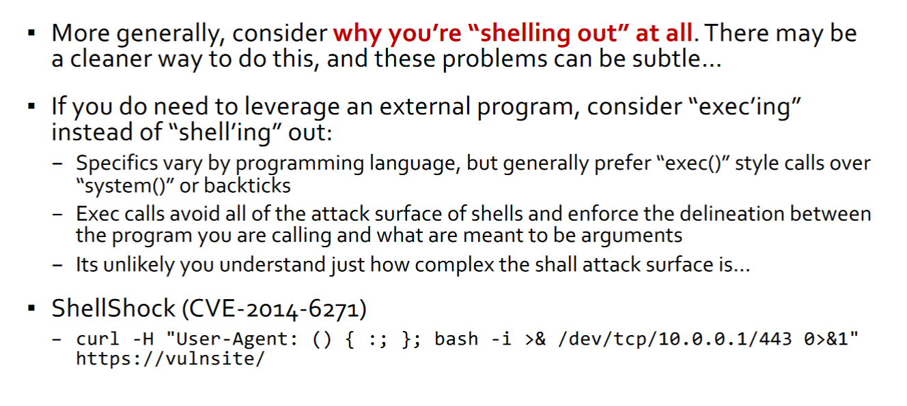
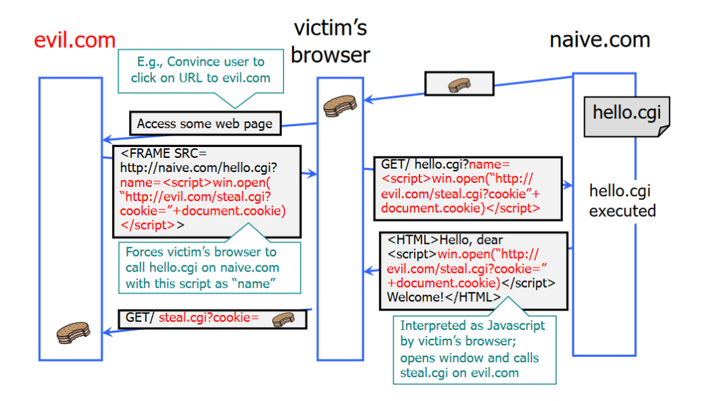
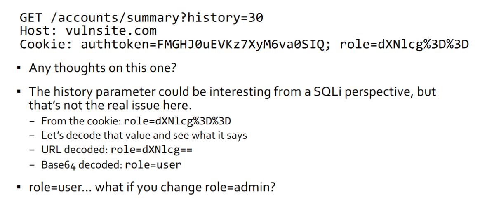

# So Much Web, So Many Problems
-  The source of most of our problems:
    - Both client and server are running code that is dynamically generated
    - Some common examples
        - Cross-site request forgery
        -  Command Injection (e.g., SQL injection)
        - Cross-site scripting (server-side)
        - IDOR

## Cross-Site Request Forgery (CSRF)
- When a user’s browser issues an HTTP GET request, it attaches all cookies associated with the target site


- Only the target site sees the cookies, but...
    - It has no way of knowing if the request was authorized by the user

## Typical Authentication Cookies


## CSRF Scenario
- User is signed into bank.com
    - An open session in another tab, or just has not signed off
    - Cookie remains in browser state
- User then visits a malicious website, attacker.com, containing
```js
<form name=BillPayForm action=http://bank.com/transfer>
<input name=recipient value=badguy>
<input name=amount=100>…
<script> document.BillPayForm.submit(); </script>
```
- HTTP Post
    - Good news! attacker.com can’t see the result of the POST request
    - Bad news! All your money is gone
- Cookie authentication is not sufficient when side effects can happen


### Note - CSRF isn't just about cookies and authentication
- An issue any place where the user's browser as some kind of privileged access via the web
    - i.e. where the server can't tell if the code that made the request is their own or an attackers
- __Example: Drive-By Pharming__
    - User visits malicious site. JavaScript scans home network looking for broadband router
    Once you find the router, try to login, replace firmware or change DNS to attacker-controlled server.  
        - 50% of home routers have guessable password.

# CSRF Defenses

## Secret Validation Token

- Static token provides no protection (attacker can simply lookup)
- Typically session-dependent identifier or token
- Attacker cannot retrieve token via GET because of Same Origin Policy

## Referer/Origin Validation
The Referer request header contains the URL of the previous web
page from which a link to the currently requested page was
followed. The Origin header is similar, but only sent for POSTs and
only sends the origin. Both headers allows servers to identify what
origin initiated the request.

### Recall: SameSite Cookies
SameSite=Lax Session cookie is allowed when following a navigation link but
blocks it in CSRF-prone request methods (e.g. POST).


### But...
- Implicitly assumes the GETs have no side effects
    - Sadly not always true
    - Need another mechanism to tell your server request is coming from you
- Assumes browsers respect SameSite attribute (i.e. and won't send cookies)
    - Old browsers ignore cookie attributes they don't recognize

## Fetch Metadata
- Solves more fundamental problem: Tell server who they are talking to and how they got there
    - Sec-Fetch-Site: {cross-site, same-origin, same-site, none}
        - Who is making the request?
    -  Sec-Fetch-Mode: {navigate, cors, no-cors, same-origin, websocker}
        - What kind of request?
– Sec-Fetch-User: ?1
Did the user initiate the request?
– Sec-Fetch-Dest: {audio,document,font,script,..}
Where does the response end up?

## CSRF Summary
An attack that forces an end user to
execute unwanted actions on another web application (where they’re typically
authenticated)

- CSRF attacks specifically target state-changing requests, not data theft since
the attacker cannot see the response to the forged request.
- Defenses:
    - Validation Tokens
    - Referer and Origin Headers: not sent with every request + privacy concern
– SameSite Cookies:, fail-open on old browsers
– Fetch Metadata: robust but not supported on old browsers


# Command Injection


## Trivial Example


```c
int main(int argc, char **argv) {
    char *cmd = malloc(strlen(argv[1]) + 100)
    strcpy(cmd, “head -n 100 ”)
    strcat(cmd, argv[1])
    system(cmd);
}
```


- Deletes all home directories

### __Never expose an interpreter to external input__

## Other Domains: Python


## Similar Code Injection Problems with eval()

- Sanitizing input by making sure we're interpreting it as an integer

## Also on Web Servers... CGI


## Command Injection Prevention
- Reasonably effective blacklists (from OWASP)
- Those are pretty good, but you’d be better off not blacklisting
- Instead, consider whitelisting only what you actually need to allow



## SQL Injection (SQLi)
- Last examples all focused on shell injection
- Many web applications have a database component (accessed via SQL)
- These can also have command injection vulnerabilities when web site developers build SQL queries using __user-provided data__

### SQL Basics


### Insecure Login Checking
```php
$login = $_POST['login'];
$sql = "SELECT id FROM users WHERE username = '$login'";
$rs = $db->executeQuery($sql);
if $rs.count > 0 {
// success
}
```


## Building an Attack


- `'; drop table users --`
    - Delete the user table from the database
- Any set of SQL commands
    - Read fields, find elements, write tables
    - Note that SQL has lots of useful functions (i.e. substrings, etc.) and a single SQL statement can have lots of functions in it
- `‘; exec xp_cmdshell ‘net user add thanos infinitypw’—`
    - On Windows SQL server, spawn a Windows shell and create a new account for
thanos, with password = infinitypw

### Blind Injection
- We had the luxury of seeing the output(syntax error, success vs failure, etc.)
    - Is that required?
- Nah. Blind SQLi
    - Result-based
        - No direct output of data, but DB/Application behavior implies SQLi outcomes, e.g.
        - … WHERE userName="alice" AND userRole="admin";-- <- App allows login
        - … WHERE userName=“bob" AND userRole="admin";-- <- App doesn’t allow login
        - We can infer from this that alice is an admin, but bob is not.
    - Efficient guesses via < and > operators
        - … WHERE userName="alice" AND userPIN=0000;-- <- False
        - … WHERE userName="alice" AND userPIN=0001;-- <- False, and I’m already sick of this
        - If we do have to guess at values, we can at least be efficient about it, use < and > Timing/Side-effects
        - No output or obvious inference points, so instead let’s sleep and measure response
    - Out-of-band channels
        - Some DBMS systems/roles have network-visible side effects (e.g., DNS lookups)

# Preventing SQL Injection
- Input Sanitization: Make sure only safe (sanitized) input is accepted
- What is unsafe?
    - Single quotes? Spaces? Dashes?
    - All could be part of legitimate input values
- One (naive) thought: Use proper escaping/encoding
    - Just add / before '
    - Most languages have libraries for excaping SQL strings
    - But what about:
        - `SELECT fields from TABLE where id= 52 or 1=1`
        - Problem is lack of typing


### Aside: Canonicalization
- Frequently input is encoded into URL
- Can still encode spaces, excapes, etc.

### Bottom Line: Don't construct SQL queries by yourself
- Two safer options:
    - Parametrized (prepared) SQL
    - ORMs (Object Relational Mappers)

## Prepared SQL


## ORMs


## Injection Summary
- Onjection attacks occur when un-sanitized user input ends up as code (shell command, argument to eval, or SQL statement)
- Remains a serious problem today
- Do not try to manually sanitize user input. You __will not__ get it right
- Simple, foolproof solution is to use safe interfaces (prepared SQL)

# Cross Site Scripting (XSS)
Attack occurs when application takes untrusted data and sends it to a web browser without proper validation or sanitization.


- Key Idea: Indirect attack on browser via server
- Malicious content is injected via URL encoding (query parameters, form submission) and reflected back by the server in the response
- Browser then executes code that server provided

### Usual Search Example


### Simple Malicious Search Example


### More Complex Examples


## Types of XSS
An XSS vulnerability is present when an attacker can inject scripting code
into pages generated by a web application.
- Reflected XSS: The attack script is reflected back to the user as part of a
page from the victim site.
- Stored XSS: The attacker stores the malicious code in a resource managed
by the web application, such as a database.

### Another Example


### Another Exmaple
- Attacker, evil.com, identifies Web site that will reflect content
    - E.g., naïve.com
```js
GET/ hello.cgi?name=Bob
hello.cgi responds with
<html>Welcome, Bob</html>
```
- And also has private cookies with potential victims
- Then convinces victim to click on a link to evil.com
    - Which fetches content from naïve.com with arguments that include code
    - Victim runs code with full access to same-origin at naïve.com



## Samy Worm
-  MySpace: largest social networking site in the world way back when
(2004-2010)
- Users can post HTML on their MySpace pages
- MySpace was sanitizing user input to prevent inclusion of JavaScript
    - But missed (at least one): javascript inside CSS tags
```js
<div style=“background:url(‘javascript:alert(1)’)”>
```
- Samy Kamkar used this on his MySpace page (2005)

## Preventing XSS: Filtering
- Key problem: rendering raw HTML from user input
- Preventing injection of scripts into HTML is hard
    - Blocking < and > is not enough
    - Event handlers
    - Beware of filter evasion tricks
    - Scripts can also be embedded directly in tags
- Filtering is really hard to do right... don't try to do it yourself

### Example
- Filter action: filter out "<script"
- <scr<scriptipt src="..."
    - <"script" src="..." 

## Content Security Policy
- CSP allows for server administrators to eliminate XSS attacks by specifying the domains that the browser should consider to be valid sources of executable scripts.
- Browser will only execute scripts loaded in source files received from whitelisted domains, ignoring all other scripts (including inline scripts and event-handling HTML attributes).
    - All browsers today follow CSP

### CSP Example 1
- Content can only be loaded from same domain; no inline scripts
- CSP: default-src 'self'

### CSP Example 2
- Allow
    - Include images from any origin
    - Restrict audio or video media to trusted providers
    - Only allow scripts from a specific server that hosts trusted code; no inline scripts
    - CSP: Content-Security-Policy: default-src 'self'; img-src *; media-src media1.com; script-src userscripts.example.com

## Another Use for CSP: Clickjacking
- Idea: overlay transparent iframe (CSS Opacity Settings) over page that convinces user to click
    - Attract user to malicious attack site
- You don't want to let anyone load your page in an iframe
    - CSP to the rescue!

## Insecure Direct Object Reference (IDOR)
- ```https://citi.com/myacct/9725126314/summary```
    - Do you see anythiing concerning with this URL?
- Parameter Tampering
    - This is one of the most conceptually simple issues, but is still very prevalent

### Another Example


